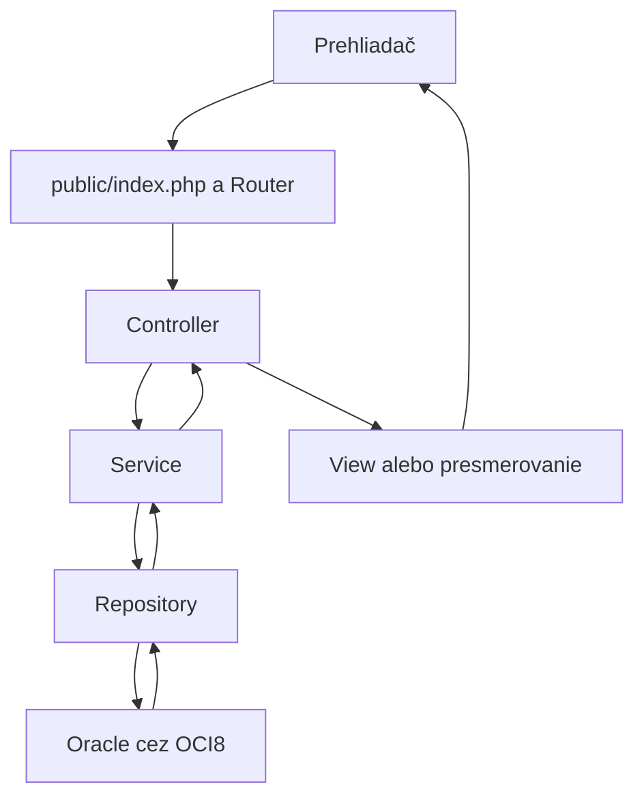

# Architektúra aplikácie ServiceDesk

## 1. Základný prístup

ServiceDesk je monolitická webová aplikácia v PHP.
Používateľské rozhranie tvoria HTML stránky generované na serveri,
CSS a podľa potreby malé množstvo JavaScriptu.

Aplikácia používa jednoduché MVC doplnené o služby a repositories.
Oracle databáza beží v Docker kontajneri. PHP sa k nej pripája
prostredníctvom OCI8 a Oracle Instant Client.

V MVP nepoužívame veľký PHP framework. Cieľom je porozumieť
spracovaniu HTTP požiadaviek, práci s reláciami, SQL a rozdeleniu
zodpovedností aplikácie.

## 2. Rozdelenie zodpovedností

| Časť | Zodpovednosť |
|---|---|
| Router | Priradí HTTP metódu a URL ku konkrétnej akcii controllera |
| Controller | Prečíta vstup, zavolá službu a vráti stránku alebo presmerovanie |
| Service | Vykoná prípad použitia, kontroluje oprávnenia a obchodné pravidlá |
| Repository | Vykonáva SQL a prevádza výsledky databázy na dáta aplikácie |
| Model | Reprezentuje používateľa, zariadenie, tiket alebo komentár |
| View | Vykresľuje HTML z pripravených dát |
| Database | Spravuje OCI8 pripojenie a databázové transakcie |

Controllers neobsahujú SQL.
Repositories nepracujú s HTTP ani nevykresľujú HTML.
Views nemenia dáta a nevykonávajú databázové dotazy.

## 3. Tok požiadavky

Príklad vytvorenia tiketu:
1. Zamestnanec odošle formulár cez POST /tickets.
2. Controller overí CSRF token a prečíta vstup.
3. TicketService overí prihlásenie, rolu, vstup a dostupnosť zariadenia.
4. TicketRepository uloží tiket cez parametrizovaný SQL dotaz.
5. Controller presmeruje používateľa na detail vytvoreného tiketu.

## 4. Štruktúra projektu

- public/
    - index.php – jediný vstupný bod webovej aplikácie
    - assets/css/ – štýly
    - assets/js/ – JavaScript
- src/
    - Core/
        - Router.php
        - Database.php
        - View.php
        - Auth.php
        - Csrf.php
    - Controllers/
        - AuthController.php
        - TicketController.php
        - CommentController.php
    - Services/
        - AuthService.php
        - TicketService.php
        - CommentService.php
    - Repositories/
        - UserRepository.php
        - DeviceRepository.php
        - TicketRepository.php
        - CommentRepository.php
    - Models/
        - User.php
        - Device.php
        - Ticket.php
        - Comment.php
- views/
    - layouts/
    - auth/
    - tickets/
- config/
    - bootstrap.php – načítanie konfigurácie a zostavenie objektov
    - routes.php – definícia rout
- database/
    - schema.sql – vytvorenie tabuliek, obmedzení a indexov
    - seed.php – vytvorenie ukážkových účtov a zariadení
- tests/
    - Unit/
    - Integration/
- docs/
- .env.example
- .gitignore
- composer.json
- composer.lock
- README.md
- check-oracle.php

Webový server sprístupňuje iba priečinok public.
Konfigurácia, zdrojové súbory a databázové skripty nie sú verejne dostupné.

Triedy používajú namespace App a Composer PSR-4 autoloading:
App\ → src/

Závislosti sa odovzdávajú cez konštruktory. Objekty sa zostavujú
explicitne v bootstrap.php, bez samostatného DI frameworku.

## 5. Hlavné routy

| Metóda | URL | Účel |
|---|---|---|
| GET | /login | Prihlasovací formulár |
| POST | /login | Prihlásenie |
| POST | /logout | Odhlásenie |
| GET | /tickets | Zoznam tiketov podľa roly |
| GET | /tickets/create | Formulár nového tiketu |
| POST | /tickets | Vytvorenie tiketu |
| GET | /tickets/{id} | Detail tiketu |
| GET | /tickets/{id}/edit | Formulár úpravy nového tiketu |
| POST | /tickets/{id}/update | Uloženie úpravy |
| POST | /tickets/{id}/claim | Prevzatie technikom |
| POST | /tickets/{id}/priority | Zmena priority |
| POST | /tickets/{id}/resolve | Vyriešenie tiketu |
| POST | /tickets/{id}/comments | Pridanie komentára |

GET požiadavky nemenia dáta.
Po úspešnom POST nasleduje presmerovanie, aby obnovenie stránky
neopakovalo odoslanú operáciu.

Router rozlišuje statické cesty, napríklad /tickets/create,
od ciest s číselným ID.

## 6. Databázová vrstva

- Pripojenie používa samostatného používateľa servicedesk.
- Vstupy sa odovzdávajú cez OCI8 bind premenné.
- Používateľské hodnoty sa nevkladajú priamo do SQL textu.
- Viackrokové zmeny používajú explicitný commit alebo rollback.
- Databázová relácia používa časové pásmo +00:00.
- Časy sa zobrazujú v Europe/Bratislava.
- Obmedzenia databázy dopĺňajú kontroly aplikačnej vrstvy.

Prevzatie tiketu sa vykoná jedným podmieneným UPDATE:
zmena uspeje iba pri stave NEW a nepridelenom technikovi.
Aplikácia overí počet zmenených riadkov. Ak je nula, oznámi,
že tiket už nemožno prevziať.

Pri úprave tiketu sa stav a oprávnenia overujú aj pri zápise,
aby súčasné prevzatie nezanechalo nepovolenú úpravu.

Operácie závislé od aktuálneho stavu, napríklad pridanie komentára,
sa koordinujú transakciou a podľa potreby zámkom riadka tiketu.
Tak sa zabráni pridaniu komentára po súčasnom vyriešení.

## 7. Bezpečnosť a konfigurácia

- Heslá sa vytvárajú pomocou password_hash() a overujú password_verify().
- Prihlásenie používa PHP session.
- Po prihlásení sa obnoví ID session.
- Odhlásenie zruší session aj jej cookie.
- Session cookie používa HttpOnly a SameSite=Lax; pri HTTPS aj Secure.
- Všetky POST formuláre používajú CSRF token.
- Oprávnenia sa kontrolujú na serveri pri každej operácii.
- Používateľský text sa pri výstupe do HTML escapuje cez htmlspecialchars().
- Prihlasovacie údaje databázy sa čítajú z premenných prostredia.
- Lokálny .env je ignorovaný Gitom; .env.example obsahuje iba vzor.
- Súbor .env načítava knižnica vlucas/phpdotenv.
- Technické chyby sa zapisujú do logu; používateľ dostane stručné hlásenie.

## 8. Testovanie

PHPUnit použijeme na:
- Unit testy pravidiel a validácie.
- Integračné testy repositories a databázových obmedzení.
- Overenie, že súčasné prevzatie tiketu umožní iba jedného technika.

Integračné testy používajú samostatnú testovaciu schému.
Nepoužívajú dáta určené na ukážku aplikácie.

Manuálne overíme celý priebeh:
prihlásenie → vytvorenie → prevzatie → komentár → vyriešenie,
vrátane pokusov o nepovolený prístup.

## 9. Nasadenie pre lokálny vývoj

- PHP beží lokálne vo Windowse.
- Oracle beží v Docker kontajneri servicedesk-oracle.
- PhpStorm slúži na vývoj, debugging a prácu s databázou.
- Lokálny PHP vývojový server používa public ako document root
  a vstupní bod index.php ako router.
- PHP vývojový server je určený iba na lokálny vývoj.