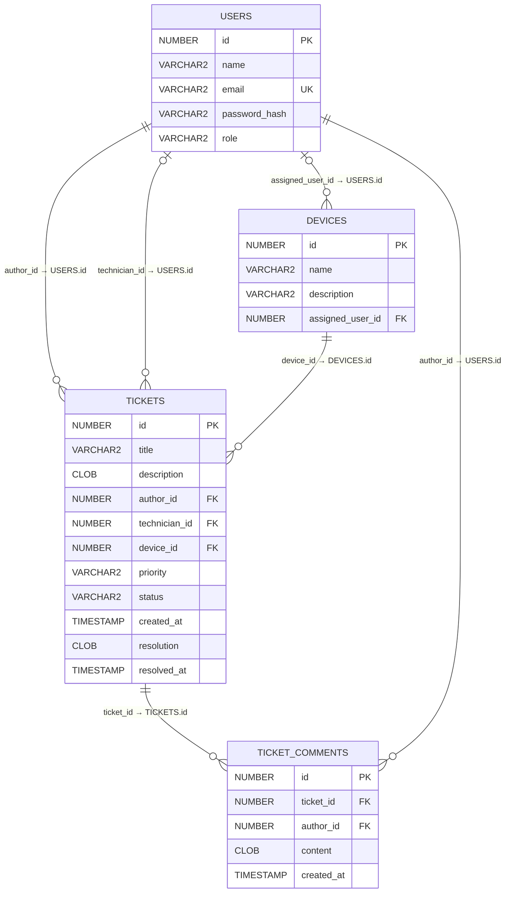

# Dátový model – ServiceDesk MVP

Model obsahuje štyri tabuľky: používatelia, zariadenia, tikety
a komentáre.

## ER diagram

## Tabuľky a stĺpce

### USERS – používatelia

Obsahuje zamestnancov aj technikov.

| Stĺpec | Oracle typ | Povinný | Obmedzenie / význam |
|---|---|---|---|
| id | NUMBER(10) | Áno | PK, generované pomocou IDENTITY |
| name | VARCHAR2(100 CHAR) | Áno | Meno používateľa |
| email | VARCHAR2(254 CHAR) | Áno | UNIQUE, prihlasovací údaj |
| password_hash | VARCHAR2(255 CHAR) | Áno | Hash hesla, nikdy pôvodné heslo |
| role | VARCHAR2(20 CHAR) | Áno | CHECK: EMPLOYEE alebo TECHNICIAN |

E-mail sa pred uložením aj pri prihlásení normalizuje na malé písmená
a odstránia sa medzery na začiatku a konci.

### DEVICES – zariadenia

Zariadenie je pridelené jednému zamestnancovi alebo je spoločné.

| Stĺpec | Oracle typ | Povinný | Obmedzenie / význam |
|---|---|---|---|
| id | NUMBER(10) | Áno | PK, generované pomocou IDENTITY |
| name | VARCHAR2(150 CHAR) | Áno | Názov zariadenia |
| description | VARCHAR2(1000 CHAR) | Nie | Bližší opis zariadenia |
| assigned_user_id | NUMBER(10) | Nie | FK → USERS.id |

Prázdne assigned_user_id znamená spoločné zariadenie.
Jeden zamestnanec môže mať pridelených viac zariadení.
Názov zariadenia nemusí byť jedinečný; zariadenie identifikuje ID.

### TICKETS – tikety

Každý tiket má jedného autora a týka sa jedného zariadenia.

| Stĺpec | Oracle typ | Povinný | Obmedzenie / význam |
|---|---|---|---|
| id | NUMBER(10) | Áno | PK, generované pomocou IDENTITY |
| title | VARCHAR2(200 CHAR) | Áno | Názov problému |
| description | CLOB | Áno | Opis problému |
| author_id | NUMBER(10) | Áno | FK → USERS.id |
| technician_id | NUMBER(10) | Nie | FK → USERS.id; povinný po prevzatí |
| device_id | NUMBER(10) | Áno | FK → DEVICES.id |
| priority | VARCHAR2(10 CHAR) | Áno | CHECK: LOW, MEDIUM, HIGH; DEFAULT MEDIUM |
| status | VARCHAR2(20 CHAR) | Áno | CHECK: NEW, IN_PROGRESS, RESOLVED; DEFAULT NEW |
| created_at | TIMESTAMP(6) | Áno | DEFAULT LOCALTIMESTAMP |
| resolution | CLOB | Nie | Spôsob riešenia; povinný pri vyriešení |
| resolved_at | TIMESTAMP(6) | Nie | Čas vyriešenia; povinný pri vyriešení |

Pravidlá konzistencie:
- NEW: bez technika, spôsobu riešenia a času vyriešenia.
- IN_PROGRESS: má technika, nemá spôsob riešenia ani čas vyriešenia.
- RESOLVED: má technika, neprázdny spôsob riešenia a čas vyriešenia.
- Čas vyriešenia nesmie byť skorší než čas vytvorenia.
- Autor musí mať rolu EMPLOYEE.
- Pridelený technik musí mať rolu TECHNICIAN.
- Autor pri vytvorení alebo zmene zariadenia smie vybrať iba svoje
  alebo spoločné zariadenie.

### TICKET_COMMENTS – komentáre

Každý komentár patrí jednému tiketu a má jedného autora.

| Stĺpec | Oracle typ | Povinný | Obmedzenie / význam |
|---|---|---|---|
| id | NUMBER(10) | Áno | PK, generované pomocou IDENTITY |
| ticket_id | NUMBER(10) | Áno | FK → TICKETS.id |
| author_id | NUMBER(10) | Áno | FK → USERS.id |
| content | CLOB | Áno | Text komentára |
| created_at | TIMESTAMP(6) | Áno | DEFAULT LOCALTIMESTAMP |

Komentáre sa zobrazujú podľa created_at a následne id.
Pridávať ich môže iba autor tiketu alebo pridelený technik,
kým tiket nie je vyriešený.

## Databázové a aplikačné kontroly

Databáza zabezpečuje:
- Primárne a cudzie kľúče.
- Jedinečnosť e-mailu.
- Povinné hodnoty pomocou NOT NULL.
- Povolené roly, priority a stavy pomocou CHECK.
- Konzistenciu stavu s pridelením technika a časom vyriešenia.
- Čas vyriešenia nie je skorší než čas vytvorenia.

Aplikácia zabezpečuje:
- Kontrolu oprávnení a rolí odkazovaných používateľov.
- Kontrolu dostupnosti zariadenia pre zamestnanca.
- Povolené prechody stavov.
- Odmietnutie textov prázdnych alebo obsahujúcich iba medzery.
- Povinný neprázdny spôsob riešenia pri vyriešení.
- Zákaz úprav a pridávania komentárov po vyriešení.
- Prevzatie tiketu ako jednu atómovú operáciu, aby pri súčasnom
  prevzatí dvoma technikmi uspel iba jeden.

Samotný cudzí kľúč na USERS nekontroluje rolu používateľa.
Samotné NOT NULL pri CLOB nekontroluje neprázdny text.

## Indexy a mazanie

Okrem indexov primárnych kľúčov a jedinečného e-mailu vytvoríme indexy:
- DEVICES(assigned_user_id)
- TICKETS(author_id)
- TICKETS(technician_id)
- TICKETS(device_id)
- TICKETS(status, priority)
- TICKET_COMMENTS(ticket_id, created_at, id)
- TICKET_COMMENTS(author_id)

MVP neumožňuje mazanie používateľov, zariadení, tiketov ani komentárov.
Cudzie kľúče nepoužívajú ON DELETE CASCADE.

## Časové údaje

Všetky časy sa ukladajú jednotne v UTC.
Databázové relácie používajú časové pásmo +00:00.
Používateľské rozhranie ich prevádza do Europe/Bratislava.